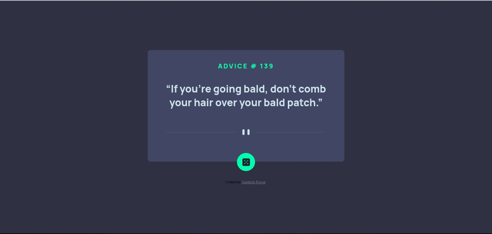
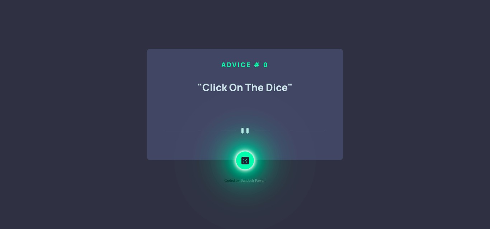
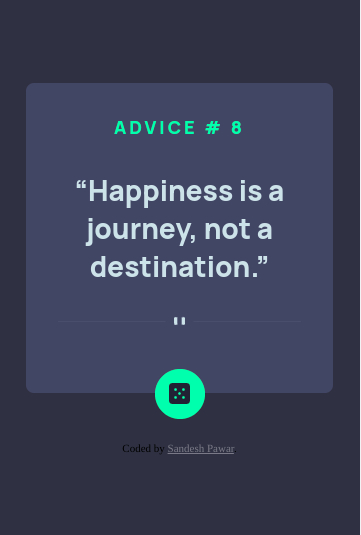

# Frontend Mentor - Advice generator app solution

This is a solution to the [Advice generator app challenge on Frontend Mentor](https://www.frontendmentor.io/challenges/advice-generator-app-QdUG-13db). Frontend Mentor challenges help you improve your coding skills by building realistic projects.

## Table of contents

- [Overview](#overview)
  - [The challenge](#the-challenge)
  - [Screenshot](#screenshot)
  - [Links](#links)
- [My process](#my-process)
  - [Built with](#built-with)
- [Author](#author)

## Overview

### The challenge

Users should be able to:

- 

### Screenshot

### Links

- [Solution](https://your-solution-url.com)
- [Live Site]( https://sandesh4141.github.io/Advice-generator-app/)

## My process

### Built with

- Semantic HTML5 markup
- CSS custom properties
- Flexbox

## Author
- Frontend Mentor - [@sandesh4141](https://www.frontendmentor.io/profile/Sandesh4141)
- Twitter - [@Sandesh32971351](https://twitter.com/Sandesh32971351)
- Instagram - [@sandesh.sp41](https://www.instagram.com/sandesh.sp41)
